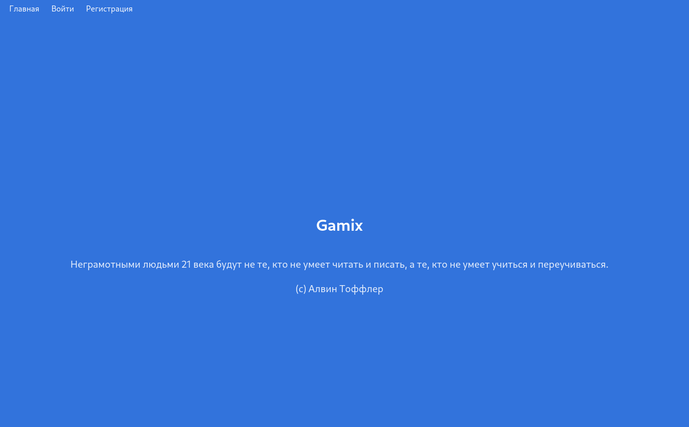
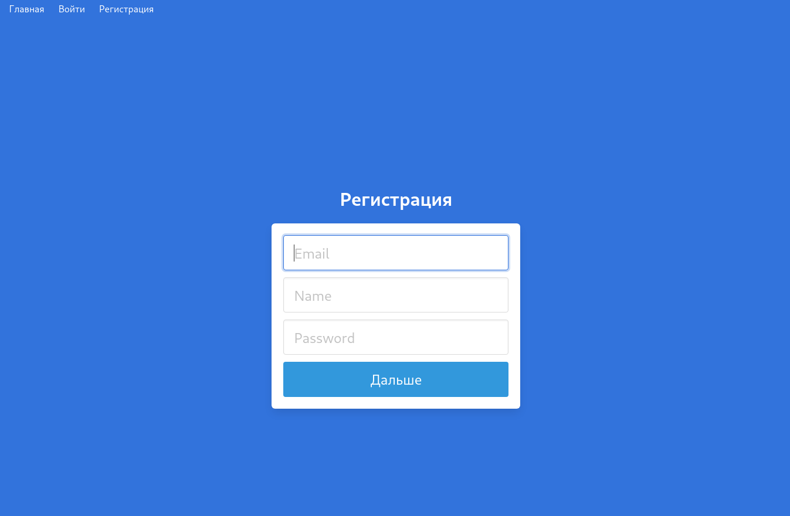
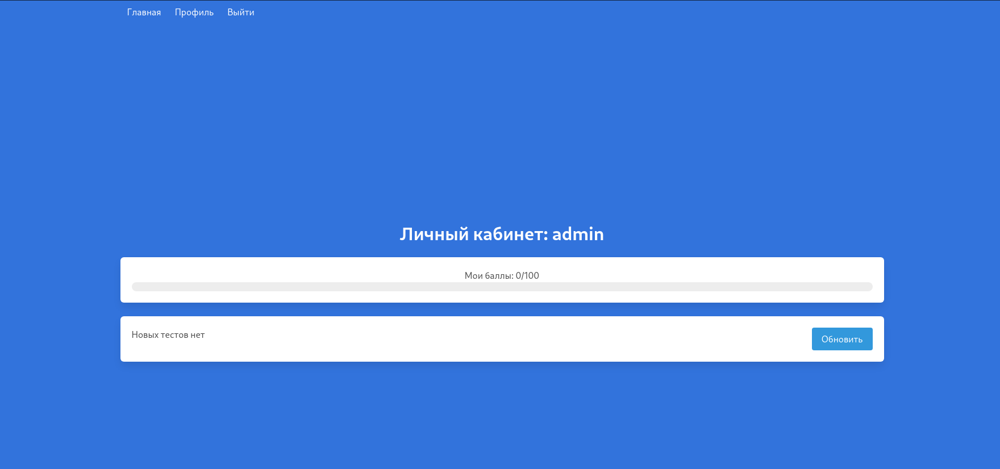

# FLASK GAMIX

## RUN
```
cd flask-auth/server
cp .env.bak .env
python3 -m venv venv
. venv/bin/activate
pip install -r requirements.txt
```
## Создание таблиц
```
python
>>> from project import db, create_app
>>> db.create_all(app=create_app())
>>> exit
flask run
```

## RUN ON HTTPS
```
python3 -m flask run --cert=cert.pem --key=key.pem 
```

## Screenshots


